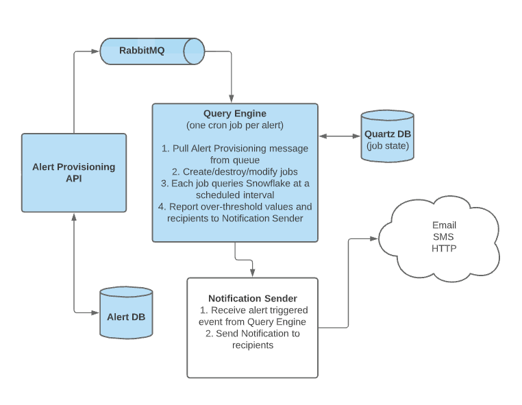

# Simple Alerting API

This project is a simple API for a dynamic, reactive alerting system (minus the notification component).
It consists of four different modules that comprise the overall functionality of the project.

* amqp
* api
* batch
* persistence

## Architecture

## Getting Started

1. Clone the project. `git clone git@github.com:Dark-Alex-17/alerting-api.git`
2. Open the `alerting-api` folder with IntelliJ. Use auto-import for a Gradle
   project.
   
## Running the API
### Start the persistence tier
The persistence tier will start up the in-memory H2 database. Once started,
Flyway will populate the database with the alerting schema and test data, and also
the default Quartz schema.

Once H2 is up and running, a TCP server is started on port 9091 so other applications 
can use the database.

The H2 browser console is available at http://localhost:8081/h2-console

`./gradlew persistence:bootRun`

### Start the batch worker
The batch worker is what picks up messages from RabbitMQ and then schedules, and executes Quartz jobs.

The worker also creates the appropriate exchanges, queues, bindings, and all consumers.

`./gradlew batch:bootRun`

### Start the Alerting API
The API is how users provision alerts and recipients, and all data is persisted to the H2 database.

Additionally, all operations send a message to RabbitMQ to provision and schedule Quartz jobs in the 
batch worker.

The API is available at http://localhost:8080/api/alerting/v1/

API documentation is available [here](https://dark-alex-17.github.io/alerting-api/)

`./gradlew api:bootRun`

## Built With

* [Kotlin](https://kotlinlang.org) - Primary language
* [Spring Boot](https://projects.spring.io/spring-boot/) - Web framework
* [Spring Data](https://spring.io/projects/spring-data-jpa) - JPA data access abstraction
* [Spring AMQP](https://spring.io/projects/spring-amqp) - Asynchronous message communication library
* [Apache Commons](https://commons.apache.org/) - Boilerplate code library
* [Lombok](https://projectlombok.org/) - Boilerplate Java code generator
* [Hibernate](https://hibernate.org/) - Persistence framework
* [Quartz Scheduler](http://www.quartz-scheduler.org/) - Job scheduling and execution framework
* [H2 Database](https://www.h2database.com/html/main.html) - In-memory prototype database
* [Flyway](https://flywaydb.org/) - Database Version Control
* [RabbitMQ](https://www.rabbitmq.com/) - Asynchronous Message Broker
* [Gradle](https://gradle.org/) - Dependency management